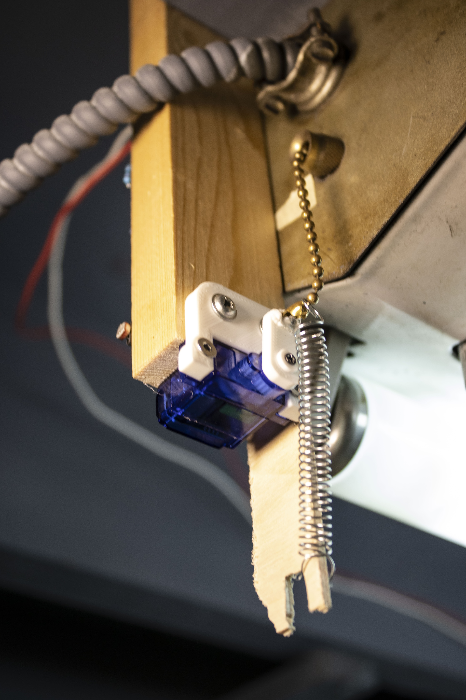

# chain-puller
Firmware for ESP8266 NodeMCU board to control light fixture pull chain with a servo through Apple's HomeKit. Based on esp-homekit-sdk lightbulb example and using ESP8266-RTOS-SDK

Instructions for esp-homekit-sdk should be followed to build the firmware: https://github.com/espressif/esp-homekit-sdk
